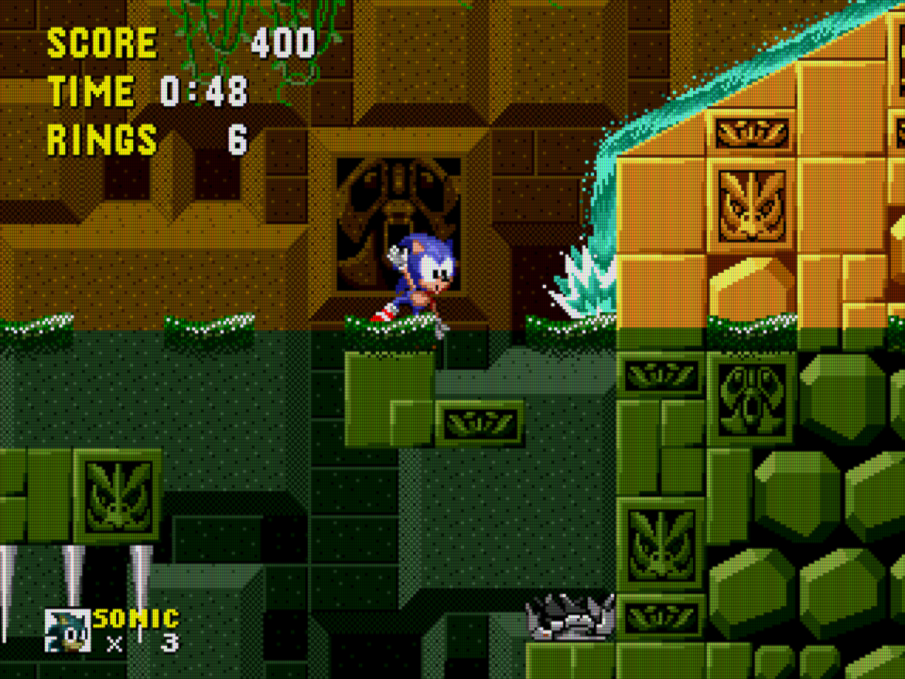

# Carlos' custom CRT shader presets for RetroArch

This repository contains a set of custom CRT shader presets for [RetroArch](https://www.retroarch.com/) based on its [glsl-shaders](https://github.com/libretro/glsl-shaders). These presets are meant to look reasonable on resolutions slightly below 1080p and have good performance on weak graphics cards — I'm using them with an [ATI Mobility Radeon HD 2600](https://en.wikipedia.org/wiki/Radeon_HD_2000_series) from **2008** driving a 1680x1050 LCD screen.


* `crt-tv.glslp` — subtle scanlines and a Trinitron-like mask (aperture grille)
* `crt-tv-slotmask.glslp` — same as `crt-tv`, but approximating a slot mask instead
* `crt-tv-monitor.glslp` — same as `crt-tv-slotmask`, but sharper
* `crt-tv-slotmask-mixed.glslp` — same as `crt-tv-slotmask` but tries to approximate slower image decay
* `crt-scanlines.glslp` — more pronounced scanlines, with no discernible mask
* `crt-mask-horizontal.glslp` — pronounced scanlines and slight blur (approximates a worn CRT)
* `crt-mask-vertical.glslp` — same as `crt-mask-horizontal` but for vertical games
* `crt-ega-newer.glslp` — scanlines and subtle mask (for [DOSBox Pure](https://github.com/schellingb/dosbox-pure) with single-scan)
* `crt-ega-older.glslp` — same as `crt-ega-newer` but slightly more blurry
* `crt-vga-newer.glslp` — no scanlines and subtle mask (for [DOSBox Pure](https://github.com/schellingb/dosbox-pure) with double-scan)
* `crt-vga-older.glslp` — same as `crt-vga-newer` but slightly more blurry
* `crt-vga-alternate.glslp` — alternative to `crt-vga-newer` with bilinear filtering

I've found that `crt-tv-slotmask` or `crt-tv` works best for consoles, but I tend to prefer `crt-scanlines` for most arcade games. I know it's less accurate, but fits better with my subjective memories somehow.

The EGA/VGA presets approximate a slot mask, when actual PC monitors most commonly used [triads](https://en.wikipedia.org/wiki/Shadow_mask#/media/File:CRT_pixel_array.jpg) (circular dots in a triangular arrangement). It's not very realistic, really, but the idea is to provide some texture to the image when viewed from a reasonable distance rather than something that stands up to close inspection. Perfectly sharp pixels on DOS games don't quite sit right with me.


## Install

Clone this repository into a subdirectory of RetroArch's shader directory, like this:

```
cd /opt/retropie/configs/all/retroarch/shaders
git clone https://github.com/carlosefr/retroarch-shaders.git custom
```

The new presets will appear in RetroArch's `Shaders / Load Preset` menu under the `custom` folder. You can name it something other than "custom" if you prefer.


## Examples

Irem's "In the Hunt" (1993) and Taito's "Puzzle Bobble" (1994) for the arcade ([lr-fbneo](https://github.com/libretro/FBNeo)), with the `crt-scanlines` preset (click for full 1680x1050 size):

&nbsp;&nbsp;

Compile's "Zanac Neo" (2001) for the original PlayStation ([lr-pcsx-rearmed](https://github.com/libretro/pcsx_rearmed)) and Sega's "Sonic the Hedgehog" (1991) for the Mega Drive ([lr-genesis-plus-gx](https://github.com/libretro/Genesis-Plus-GX)), with the `crt-tv` preset (click for full 1680x1050 size):

&nbsp;&nbsp;

Sinc LAIR's "Aliens: Neoplasma II" (2024) for the ZX Spectrum ([lr-fuse](https://github.com/libretro/fuse-libretro)) and Nintendo's "Super Mario Bros." (1985) for the NES ([lr-fceumm](https://github.com/libretro/libretro-fceumm)), with the `crt-tv-slotmask` preset (click for full 1680x1050) size:

&nbsp;&nbsp;
